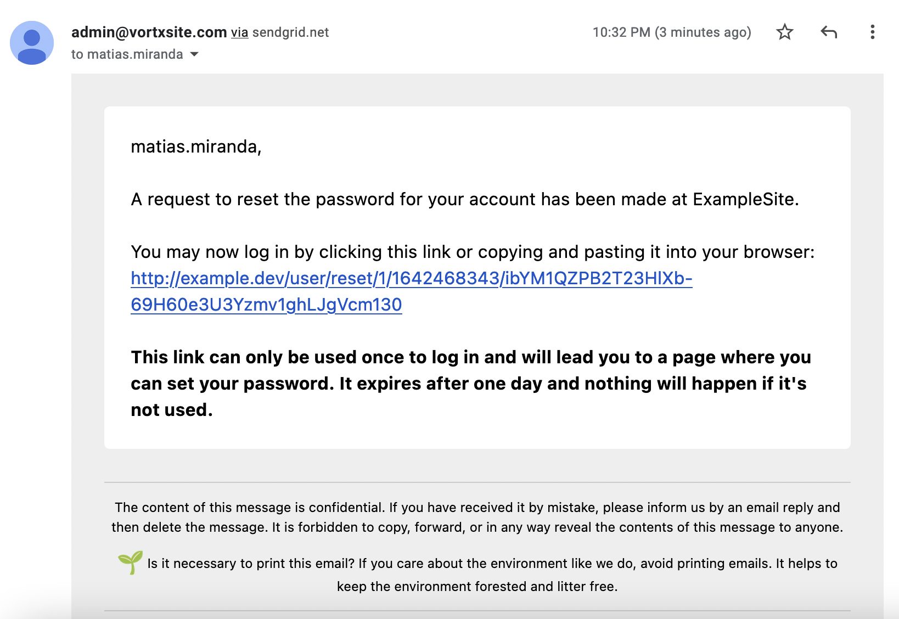

SendGrid Mailer
===============

https://www.drupal.org/project/sendgrid_mailer

This module provides a Mail class to be used with `MailSystem` module to send HTML emails using `SendGrid API`.

SendGrid Mailer module provides an HTML wrapper to email's body, you can create your own email wrapper template by creating
a file called `sendgrid-mailer-wrapper.html.twig` on your theme directory, specific templates can be used by module and key, for example,
for the core user module's 'password_reset', you can create an specific template named as
`sendgrid-mailer-wrapper--user--password-reset.html.twig`

`message`, `module` and `key` variables are available in templates.

Currently, this module supports:
- HTML email sending.
- Recipients (To, Cc, Bcc).
- Attachments.
---
Installation
------------
1. Install [`MailSystem`](https://www.drupal.org/project/mailsystem) module.
2. Install [`SendGrid API`](https://www.drupal.org/project/sendgrid_api) module.
3. Install this module.
4. Go to MailSystem configuration form at `admin/config/system/mailsystem`, set for `Formatter` and `Sender` the `SendGrid Mailer` option.
5. [Follow instructions to configure SendGrid API](https://git.drupalcode.org/project/sendgrid_api/-/blob/1.x/README.md).
6. Test configuration by sending an email, for example requesting a new password (`/user/password`).
7. You should receive an email that looks like this:
   

---
Future features
---------------
- Send email using `Dynamic Transactional Templates`.
- Implement `Contacts API - Recipients`.
---
@TODO
-----
- Write Unit/FunctionalTests.

